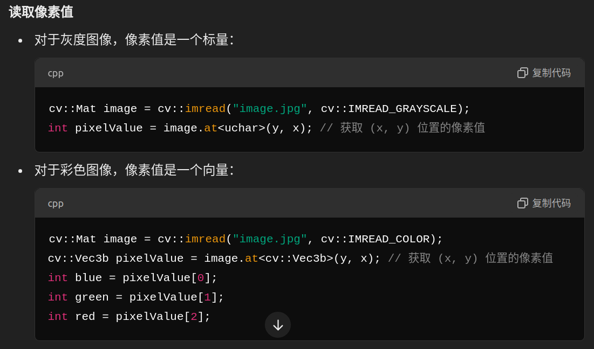

```cpp
cv::Mat img(3, 4, CV_8UC3, cv::Scalar(0, 0, 1));

/*  img:
(0, 0, 1) (0, 0, 1) (0, 0, 1) (0, 0, 1)
(0, 0, 1) (0, 0, 1) (0, 0, 1) (0, 0, 1)
(0, 0, 1) (0, 0, 1) (0, 0, 1) (0, 0, 1)
*/

cv::Vec3b vc3 = img.at<cv::Vec3b>(0, 0);//cv::Vec3x对应三通道数据，cv::Vec2x对应二通道数据，cv::Vec4x对应四通道数据
int first = (int)vc3.val[0];
int second = (int)vc3.val[1];
int third = (int)vc3.val[2];
std::cout << first << " " << second << " " << third << "" << std::endl;
//first = 0，second = 0，third = 1

for (int i = 0; i < img.rows; i++)
{
  uchar* ptr = img.ptr<uchar>(i); 
  for (int j = 0; j < img.cols*img.channels(); j++)
  {
    std::cout << (int)ptr[j] << " ";
  }
  std::cout << std::endl;
}
// 也可以：image.at<uchar>(i, j) -> i对应的是y坐标 ，j对应的是x坐标
// 当读取第2行数据中第3个数据时， 可以用b.ptr<uchar>(1)[2]的形式来直接访问.

/* 输出：
0 0 1 0 0 1 0 0 1 0 0 1 
0 0 1 0 0 1 0 0 1 0 0 1 
0 0 1 0 0 1 0 0 1 0 0 1
*/


// ---
cv::MatIterator_<cv::Vec3b> it = img.begin<cv::Vec3b>();//mat是什么类型，就要用什么类型的iterator接受指针，不然会报错
cv::MatIterator_<cv::Vec3b> it_end = img.end<cv::Vec3b>();
for (int i = 0; it != it_end; it++)
{
  std::cout << *it << " ";//可以直接输出 vec3b 类型的值 <- *it
  if ((++i % img.cols) == 0)
  {
    std::cout << std::endl;
  }
}

std::cout << (int)(*(img.data + img.step[0] * 1 + img.step[1] * 1 + 1)) << std::endl;//讲解了data和step的用法
/*
img.data + img.step[0] * 1：这个部分是偏移到第二行的开头。img.step[0] 是每一行的字节数，乘以 1 意味着我们要跳到第二行。
img.step[1] * 1：这个部分是偏移到第二列的像素。img.step[1] 是每个像素的字节数（即 3），乘以 1 意味着我们要跳到第二列的像素。
+ 1：最终这个偏移量是偏移到第二行第二列的第一个通道，即 (1, 1) 位置的红色通道（R 通道）。
*/

```
