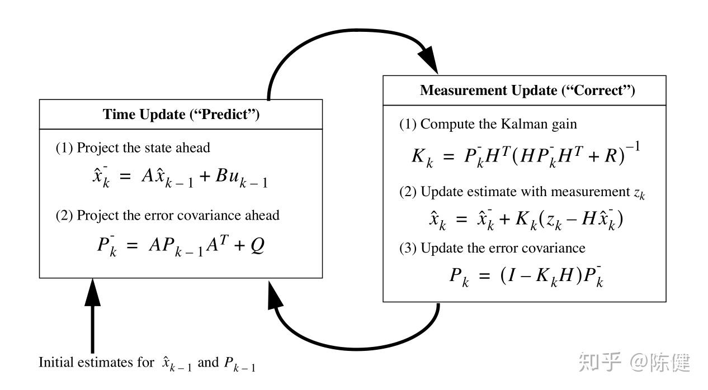

## 1. 齐次和线性


## 2. 状态空间表达式


## 3. 参数分析


---
## 卡尔曼滤波的先验估计、后验估计

卡尔曼滤波（Kalman Filter）是一种用于估计动态系统状态的数学方法，尤其适用于含有噪声的测量数据。它广泛应用于控制系统、导航、机器人等领域。

### 先验估计的概念

我们可以把**先验估计**（Prior Estimate）解释为一个“初步的猜测”，或者说是我们在没有收到最新观测数据之前，对系统状态的一个预估值。

### 1. 初始估计（Prior Estimate）

卡尔曼滤波器会根据系统的数学模型和之前的估计结果，来对当前时刻的系统状态做出一个初步的估计。这个估计是基于已知的信息，比如系统的运动方程和前一时刻的状态。

### 2. 误差协方差

每个估计都有不确定性，卡尔曼滤波器还会估算这个估计的精度，称为误差协方差（Error Covariance）。误差协方差较小意味着当前估计的可靠性较高，反之则可靠性较低。


## 先/后验估计的概念

1. **先验估计**：首先，卡尔曼滤波通过系统的数学模型，根据之前的状态和动态方程进行预测，得到一个初步的估计，这就是**先验估计**。
   
2. **观测更新**：然后，卡尔曼滤波器使用来自传感器或其他测量手段的**实际观测数据**来对先前的估计进行修正。

3. **后验估计**：结合先验估计和新的观测数据后，卡尔曼滤波会计算出一个更加精确的估计值，这个更新后的值就是**后验估计**。这个估计会比先验估计更加准确，因为它融入了真实的观测信息。

## 例子：汽车导航系统

假设你有一个汽车导航系统，它的任务是估计汽车的位置和速度。汽车的运动模型是已知的，系统每秒钟都会预测汽车的位置和速度，但GPS信号有时会因为天气、建筑物等因素出现噪声，导致测量不准确。

- ### 先验估计

  在每一时刻，系统会使用上一时刻的状态（位置和速度）来预测当前时刻的状态。假设上一次测量时你知道汽车的速度是10米/秒，位置在某个点。根据运动方程（假设是匀速直线运动），系统预测下一时刻的位置和速度。

  这个预测的结果就是**先验估计**，是基于已有信息（上一时刻的位置和速度）进行的推算。

- ### 观测数据

  然后，汽车的GPS系统测量到当前位置，可能由于各种原因，GPS的位置数据出现了偏差，显示汽车当前的位置是一个不太准确的数值（比如测量误差导致位置出现偏差）。这时，GPS的数据就成了新的**观测数据**。

- ### 后验估计

  卡尔曼滤波会根据预测的**先验估计**（汽车的位置和速度）和实际的**GPS测量数据**，通过加权平均的方法得到一个更加准确的估计。这个加权过程会考虑先验估计和观测数据的信任度，最终得到的结果就是**后验估计**。

  - 如果先验估计的精度较高，后验估计会更接近先验估计。
  - 如果GPS信号的精度较高，后验估计会更接近GPS测量值。

- ### 对应的字母：
  - #### 先验估计

    - **先验状态估计**：对应公式中的 \( \hat{x}_k^- \)
      - **\( \hat{x}_k^- \)**：是基于上一时刻的状态（位置和速度）通过运动模型预测的当前时刻的状态，即**先验估计的状态**。
  
    - **先验协方差估计**：对应公式中的 \( P_k^- \)
      - **\( P_k^- \)**：是根据上一时刻的协方差 \( P_{k-1} \) 加上过程噪声协方差 \( Q \) 预测的当前时刻的估计误差协方差，即**先验估计的协方差**。
  - #### 后验估计

    - **后验状态估计**：对应公式中的 \( \hat{x}_k \)
      - **\( \hat{x}_k \)**：是卡尔曼滤波器结合预测值（先验估计）和观测值（GPS测量值）之后，经过卡尔曼增益加权更新后的最终估计值，即**后验估计的状态**。

    - **后验协方差估计**：对应公式中的 \( P_k \)
      - **\( P_k \)**：是更新后的协方差，表示新的状态估计的不确定性，即**后验估计的协方差**。
---
### 01 卡尔曼滤波简介
- 百度百科：卡尔曼滤波（Kalman filtering）是一种利用线性系统状态方程，通过系统输入输出观测数据，对系统状态进行最优估计的算法。由于观测数据中包括系统中的噪声和干扰的影响，所以最优估计也可看作是滤波过程。
- 数据滤波是去除噪声还原真实数据的一种数据处理技术，Kalman滤波在测量方差已知的情况下能够从一系列存在测量噪声的数据中，估计动态系统的状态。由于它便于计算机编程实现，并能够对现场采集的数据进行实时的更新和处理，Kalman滤波是目前应用最为广泛的滤波方法，在通信，导航，制导与控制等多领域得到了较好的应用。

- 卡尔曼滤波的应用领域非常广泛，在航空航天、信息技术等领域尤为广泛。

### 02 卡尔曼滤波概要
- 由于我们在实际工程中，测量往往存在很多不确定性，这些不确定性包括有1）不存在完美的数学模型；2）系统的扰动是不可控的，也很难建模的；3）测量的传感器本身存在着误差。而影响我们这种误差的称为噪声，例如我们在使用PNP测距的时候，远距离是非常不精确的，它的波动可能会很大，这个时候我们就需要进行一下滤波，如下图所示（蓝色为滤波后数据、红色为实际测量值、绿色为理想测量值）

- 在我的理解里，卡尔曼滤波就相当于一个带有权重的低通滤波，即调整观测值的权重(测量值)和估计值的权重，是更相信观测值还是更相信估计值的一个过程，观测值*权重+估计值*权重 = 修正值，即最优估计。

- Kalman滤波是一种递归过程，主要两个更新过程：时间更新和观测更新，其中时间更新主要包括状态预测和协方差预测，主要是对系统的预测，而观测更新主要包括计算卡尔曼增益、状态更新和协方差更新，因此整个递归过程主要包括五个方面的计算：
1、状态预测；
2、协方差预测；
3、卡尔曼增益
4、状态更新（修正）；
5、协方差更新（修正）；

- 卡尔曼滤波的适用条件主要有：
1、应用系统必须是线性的；
2、对测量造成影响的噪声必须是符合高斯分布的白噪声。

> 白噪声：是一种功率谱密度为常数的随机信号或随机过程。即此信号在各个频段上的功率一致。其余的统称为有色噪声

---
## 卡尔曼滤波一维公式

| 步骤          | 公式                                       | 含义                                      |
|---------------|--------------------------------------------|-------------------------------------------|
| **预测步骤**  | \( \hat{x}_k^- = \hat{x}_{k-1} + u_k \)   | **预测状态**：上一时刻的估计状态加上控制输入 \( u_k \) |
|               | \( P_k^- = P_{k-1} + Q \)                 | **预测协方差**：上一时刻的协方差加上过程噪声协方差 \( Q \) |
| **更新步骤**  | \( K_k = \frac{P_k^-}{P_k^- + R} \)       | **卡尔曼增益**：预测协方差与预测协方差加上观测噪声 \( R \) 的比值 |
|               | \( \hat{x}_k = \hat{x}_k^- + K_k(y_k - \hat{x}_k^-) \) | **更新状态估计**：预测状态加上卡尔曼增益与实际观测值与预测值的差值 |
|               | \( P_k = (1 - K_k) P_k^- \)               | **更新协方差**：调整后的协方差，表示估计误差的信任程度 |

### 变量说明：

\( Q \)           | **过程噪声协方差**：描述过程中的不确定性或噪声
\( R \)           | **观测噪声协方差**：描述测量中的噪声或不准确性


---

### 1. **预测阶段**：
假设我们知道物体的初始状态（位置、速度），并且有一个运动模型可以预测下一时刻的状态。卡尔曼滤波的预测方程如下：

**\[
\hat{x}_k^- = F \hat{x}_{k-1} + B u_k
\]**
**\[
P_k^- = F P_{k-1} F^T + Q
\]**

- \(\hat{x}_k^-\) 是预测的状态估计。
- \(F\) 是状态转移矩阵，表示物体的运动模型。
- \(P_k^-\) 是预测误差协方差矩阵，反映了预测的置信度。
- \(Q\) 是过程噪声协方差，表示运动模型的不确定性。

### 2. **更新阶段**：
当新的观测数据（如位置传感器的读数）可用时，卡尔曼滤波通过更新预测值来减少误差。更新公式如下：

**\[
K_k = P_k^- H^T (H P_k^- H^T + R)^{-1}
\]**
**\[
\hat{x}_k = \hat{x}_k^- + K_k (z_k - H \hat{x}_k^-)
\]**
**\[
P_k = (I - K_k H) P_k^-
\]**

- \(K_k\) 是卡尔曼增益，它决定了预测与观测之间的权重。
- \(z_k\) 是当前的观测值。
- \(H\) 是观测矩阵，将状态转换为观测值的形式。
- \(R\) 是观测噪声协方差，表示观测数据的噪声程度。
- \(\hat{x}_k\) 是更新后的状态估计。


---



---


---


---
到目前为止，我们已经利用卡尔曼滤波将云台的控制信号优化到一个令人满意的地步了，但是在实际测试过程中发现在打击动态目标时的命中率还是很低，具体表现是子弹始终落在移动目标后方 ，究其原因就是因为没有考虑到系统的延迟。

最简单的运动预测就是认为目标是匀速移动，用速度乘上系统的延迟时间，就得到了超前量，然后加到云台角度的设定上。在我们刚才设置的运动模型中，包含有速度状态，因此可以直接从卡尔曼的输出结果中调用。

**4.5 相机转移到云台上**
前面所有的测试都是把相机放在底盘上进行的，这是为了保持相机相对稳定，能够很简单的获取目标相对于地面的真实运动情况，但是在实战中，不仅要求能够准确命中目标，还要能够有效的躲避敌人的攻击，例如最常用的扭腰，在这种情况下，底盘的运动幅度甚至会远大于云台；此外，为了保证相机视角的迅速切换，也要求相机被安装在云台上。

相机跟随云台一起运动，最本质的区别就是去掉了相机相对于地面静止不动的前提。根据之前的推论，想要准确的跟踪目标就需要在绝对坐标系下进行计算，因此需要利用云台的姿态和与云台上相机获取的目标坐标进行处理，得到其在绝对坐标系下的位置和速度。但是该方案需要对机器人自身做出准确迅速的定位，难以实现。

一种可行的方案是将相机坐标系下计算出的目标位置（角度量）加到云台自身实际角度上（考虑到延迟，需要使用几十ms前的历史数据），然后进行卡尔曼滤波，再超前推算一小段时间得到云台的目标位置。实测该方案能够取得比较好的控制效果。

---
## 如何调整卡尔曼滤波器以提高/降低灵敏度

### 1. 过程噪声协方差矩阵 \(Q\)

- **作用**：过程噪声协方差矩阵控制着卡尔曼滤波对模型预测的信任程度。较大的 \(Q\) 值表示对预测的信任较小，允许估计随测量数据变化更多地调整；而较小的 \(Q\) 值表示对模型的预测更为依赖。
  
- **如何调整**：为了使卡尔曼滤波对测量数据更灵敏，可以适当增大 \(Q\) 值，使得卡尔曼滤波器更加关注测量数据的更新，而不是过于依赖预测模型。

**代码示例**：
```cpp
setIdentity(KF.processNoiseCov, Scalar::all(1e-3)); // 提高过程噪声的协方差，灵敏度更高
```

### 2. 观测噪声协方差矩阵 \(R\)

- **作用**：观测噪声协方差矩阵控制着卡尔曼滤波对观测值的信任程度。较大的 \(R\) 值表示测量数据被认为噪声较大，卡尔曼滤波会对预测更依赖；而较小的 \(R\) 值则意味着测量数据被认为较为准确，卡尔曼滤波会更信任观测数据。
  
- **如何调整**：为了使卡尔曼滤波更灵敏，可以减小 \(R\) 值，从而让卡尔曼滤波更加信任观测数据，迅速调整其估计。

**代码示例**：
```cpp
setIdentity(KF.errorCovPost, Scalar::all(1e-2)); // 减小误差协方差，提升灵敏度
```

### 3. 后验误差协方差矩阵 \(P\)

- **作用**：后验误差协方差矩阵表示卡尔曼滤波器当前估计的误差范围。较大的 \(P\) 值表示对当前状态估计的信任较低，需要更多依赖测量数据来调整估计；较小的 \(P\) 值表示信任当前的估计较多。
  
- **如何调整**：减小 \(P\) 的初始值可以使得卡尔曼滤波器对测量的变化反应更迅速，但会增加噪声的影响。

**代码示例**：
```cpp
setIdentity(KF.errorCovPost, Scalar::all(1e-2)); // 减小误差协方差，提升灵敏度
```
### 4. 卡尔曼增益 \(K\)

- **作用**：卡尔曼增益决定了卡尔曼滤波器对新观测数据的响应程度。较大的 \(K\) 值会使得卡尔曼滤波器对新数据的反应更加灵敏，较小的 \(K\) 值则使得卡尔曼滤波器对新数据的反应更平缓。
  
- **如何调整**：通过调整过程噪声和观测噪声，间接地影响卡尔曼增益。如果需要卡尔曼滤波更灵敏，则通常通过减小观测噪声协方差矩阵 \(R\) 或增大过程噪声协方差矩阵 \(Q\) 来实现。

### 调整建议总结

- **增加过程噪声协方差矩阵 \(Q\)**：提高灵敏度，使得滤波器更加依赖观测数据进行更新。
- **减小观测噪声协方差矩阵 \(R\)**：减少对噪声的关注，使得滤波器更加信任观测数据。
- **减小后验误差协方差矩阵 \(P\)**：使滤波器更快速地响应状态变化。

通过这些调整，卡尔曼滤波器就能对输入的测量数据做出更快、更灵敏的反应。


---
在卡尔曼滤波的一维模型中，观测矩阵通常用来将状态向量映射到观测空间。在一维卡尔曼滤波中，我们通常假设状态向量由位置和速度组成。假设状态向量为：

\[
\mathbf{x} = \begin{bmatrix} 
x \\ 
\dot{x} 
\end{bmatrix}
\]

其中，\( x \) 是位置，\( \dot{x} \) 是速度。

对于卡尔曼滤波的观测模型，假设我们只能观测到位置 \( x \)，但无法直接观测到速度 \( \dot{x} \)。因此，观测矩阵 \( \mathbf{H} \) 用来将状态向量 \( \mathbf{x} \) 转换为观测值 \( z \)。如果我们假设观测量 \( z \) 只是位置值，那么观测矩阵应为：

\[
\mathbf{H} = \begin{bmatrix} 
1 & 0 \\
0 & 1
\end{bmatrix}
\]

这意味着：

- 第一行 \( [1, 0] \) 表示通过状态向量中的位置（\( x \)）来获取观测值 \( z \)，
- 第二行 \( [0, 1] \) 表示速度 \( \dot{x} \) 对观测值 \( z \) 没有影响。

如果观测矩阵的形式为

\[
\begin{bmatrix} 
1 & 0 & 0 & 0 \\
0 & 1 & 0 & 0 
\end{bmatrix}
\]

它是四维状态模型中的一种特例。例如，如果状态向量包含了位置、速度、加速度和某种外部影响因素（例如扰动或控制输入），那么这种观测矩阵就能够选取其中的两个状态变量（位置和速度）来进行测量，从而解释为什么它的形式是这样。


## 例子：

