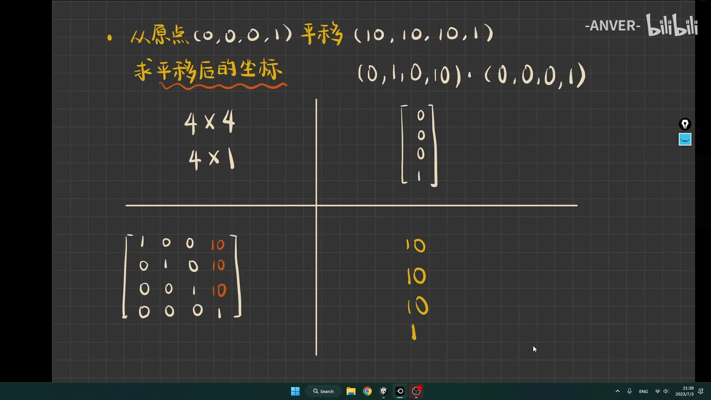

可参考：
  - https://blog.csdn.net/shenghuaDay/article/details/73611392
  - https://blog.csdn.net/weixin_44350205/article/details/117625534
  - https://www.bilibili.com/video/BV1DX4y1Y7dN

## 为何要有这三个矩阵？
  - 1. 计算机中图像处理的方式为矩阵运算
  - 2. `矩阵A` 点乘/乘 `矩阵B` 得**目标矩阵**
  - 3. 所以矩阵的变化少不了中间矩阵
  - 4. 这三个矩阵就是计算中的中间矩阵

## 1. 旋转矩阵（Rotation Matrix）

旋转矩阵用来表示物体在空间中的旋转变换。它不改变物体的形状或大小，只是改变物体的方向。

- **二维旋转矩阵**：在二维空间中，物体绕原点（0, 0）旋转的旋转矩阵可以表示为：
  \[
  R(\theta) =
  \begin{bmatrix}
  \cos(\theta) & -\sin(\theta) \\
  \sin(\theta) & \cos(\theta)
  \end{bmatrix}
  \]
  其中，\(\theta\)是旋转的角度。这个矩阵表示将一个点在二维平面上绕原点顺时针或逆时针旋转角度\(\theta\)。

- **三维旋转矩阵**：在三维空间中，旋转矩阵通常有三个常见的形式，分别表示绕X轴、Y轴和Z轴的旋转。
  - 绕X轴旋转的旋转矩阵为：
    \[
    R_x(\theta) =
    \begin{bmatrix}
    1 & 0 & 0 \\
    0 & \cos(\theta) & -\sin(\theta) \\
    0 & \sin(\theta) & \cos(\theta)
    \end{bmatrix}
    \]
  - 绕Y轴旋转的旋转矩阵为：
    \[
    R_y(\theta) =
    \begin{bmatrix}
    \cos(\theta) & 0 & \sin(\theta) \\
    0 & 1 & 0 \\
    -\sin(\theta) & 0 & \cos(\theta)
    \end{bmatrix}
    \]

  - 绕Z轴旋转的旋转矩阵为：
    \[
    R_z(\theta) =
    \begin{bmatrix}
    \cos(\theta) & -\sin(\theta) & 0 \\
    \sin(\theta) & \cos(\theta) & 0 \\
    0 & 0 & 1
    \end{bmatrix}
    \]

绕X轴和Y轴的旋转矩阵也是类似的，只是旋转的方向和轴不同。

旋转矩阵的特点是：
- 它们是正交矩阵，意味着它们的逆矩阵等于其转置矩阵。
- 它们保持物体的尺度和角度不变。

## 2. 平移矩阵（Translation Matrix）

平移矩阵用于表示物体在空间中的平移变换。它通过平移向量将物体的位置从一个点移动到另一个点。

- **二维平移矩阵**：在二维空间中，平移矩阵将一个点 \((x, y)\) 平移 \( \Delta x \) 和 \( \Delta y \) 距离，平移矩阵表示为：
  \[
  T = 
  \begin{bmatrix}
  1 & 0 & \Delta x \\
  0 & 1 & \Delta y \\
  0 & 0 & 1
  \end{bmatrix}
  \]
  这个矩阵用于将二维坐标系中的点进行平移。

- **三维平移矩阵**：在三维空间中，平移矩阵可以将一个点 \((x, y, z)\) 平移 \( \Delta x, \Delta y, \Delta z \) 距离，平移矩阵表示为：
  \[
  T =
  \begin{bmatrix}
  1 & 0 & 0 & \Delta x \\
  0 & 1 & 0 & \Delta y \\
  0 & 0 & 1 & \Delta z \\
  0 & 0 & 0 & 1
  \end{bmatrix}
  \]
- 注意：最后一个参数叫作w,跟计算机有关

平移矩阵的特点是：
- 平移矩阵不改变物体的形状或方向，只改变物体的位置。
- 它不属于线性变换，但可以与旋转矩阵等线性变换结合使用。
## 3. 缩放矩阵（Scaling Matrix）

### 三维缩放矩阵

在三维空间中，假设有一个点 \( P(x, y, z) \)，我们希望通过缩放因子 \( S_x \), \( S_y \), 和 \( S_z \) 来分别沿 x, y, z 轴进行缩放。

### 三维缩放变换

通过缩放变换，点 \( P(x, y, z) \) 会变成新点 \( P'(x', y', z') \)，其坐标为：
\[x' = S_x \cdot x\]\[y' = S_y \cdot y\]\[
z' = S_z \cdot z\]

### 三维缩放矩阵

因此，通过这个缩放矩阵对点 \( P(x, y, z) \) 进行变换，得到新的点 \( P'(x', y', z') \)：

\[
\begin{bmatrix}
x' \\
y' \\
z'
\end{bmatrix}
\ = 
\begin{bmatrix}
S_x & 0 & 0 \\
0 & S_y & 0 \\
0 & 0 & S_z
\end{bmatrix}
\begin{bmatrix}
x \\
y \\
z
\end{bmatrix}
\]

## 4. 结合旋转和平移矩阵

在三维空间中的变换通常涉及到旋转和平移的组合。例如，如果你想先旋转一个物体然后再进行平移，可以将旋转矩阵和平移矩阵组合成一个变换矩阵：
\[
\text{变换矩阵} = T \times R
\]
这样可以通过矩阵乘法一次性完成旋转和平移操作。

