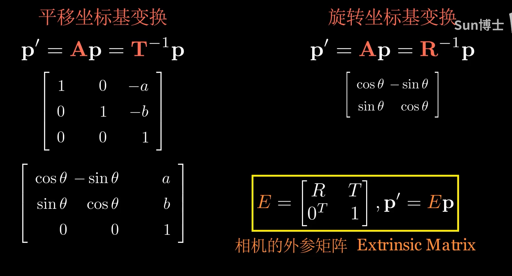

前提知识（链接） - Perspective-n-Point：
- [旋转、平移、缩放矩阵](旋转、平移、缩放矩阵.md)
- [相机模型](https://zhuanlan.zhihu.com/p/531709563)
- [RM视觉赛季总结-第二部分-装甲板坐标解算](https://zhuanlan.zhihu.com/p/419868049)
  
[TOC]

---
### 相机坐标系到像素坐标系之间的坐标转换：
  - 涉及缩放矩阵以及旋转矩阵
  

---
### 相机畸变：
  
  
  
  
  

---
### 必看 - 相机模型补充讲解
- https://www.bilibili.com/video/BV12u411G71A
  

---
### 姿态解算
  
  

---
### 重要变量/函数


```cpp
  cv::solvePnP(
    InputArray objectPoints,    // 3D 世界坐标点
    InputArray imagePoints,     // 对应的 2D 图像坐标点
    InputArray cameraMatrix,    // 相机内参矩阵
    InputArray distCoeffs,      // 相机畸变系数
    OutputArray rvec,           // 输出的旋转向量
    OutputArray tvec,           // 输出的平移向量
    bool useExtrinsicGuess = false,  // 是否使用外部猜测值（旋转和平移的初始估计）
    int flags = SOLVEPNP_ITERATIVE // 求解方法的标志（默认是迭代法）
)
```
- **`useExtrinsicGuess`** (是否使用外部猜测值):
   - 类型：bool
   - 说明：指示是否使用外部给定的初始旋转和平移估计值。如果设置为 true，则函数将使用提供的初始值来优化求解过程。如果为 false（默认值），则函数会随机初始化估计值。

- **`flags`** (求解方法的标志):
  - 类型：int
  - 说明：指定使用的求解算法，常见的标志有：
`SOLVEPNP_ITERATIVE`（默认值）：使用迭代法（如 Levenberg-Marquardt）进行求解。
`SOLVEPNP_P3P`：使用 P3P 算法（仅需要 4 个点，精度较高，但不适用于较小的点集）。
`SOLVEPNP_DLS`：使用 DLS 算法（适用于部分点丢失的情况）。

**cv::Rodrigues(input, output):**
1. **旋转向量转旋转矩阵**： 旋转向量是一种紧凑的3D旋转表示方法。向量的方向表示旋转轴，向量的模长表示旋转角度（单位是弧度）。使用 Rodrigues 可以将旋转向量转换为3x3的旋转矩阵。

2. **旋转矩阵转旋转向量**： 旋转矩阵可以转换回旋转向量。

**旋转矩阵to欧拉角（yaw pitch roll）：**

```cpp
#include <cmath>
#define radian2degree 57.3 // （180/pi）弧度制转角度单位
double atan2(double y, double x);
// 返回的是从 x 轴到点 (x, y) 的角度，单位为 弧度。
```


---
### 欧拉角


---
### 总结
  
  

---
补充图片

- 2D-2D
  
  
  
  